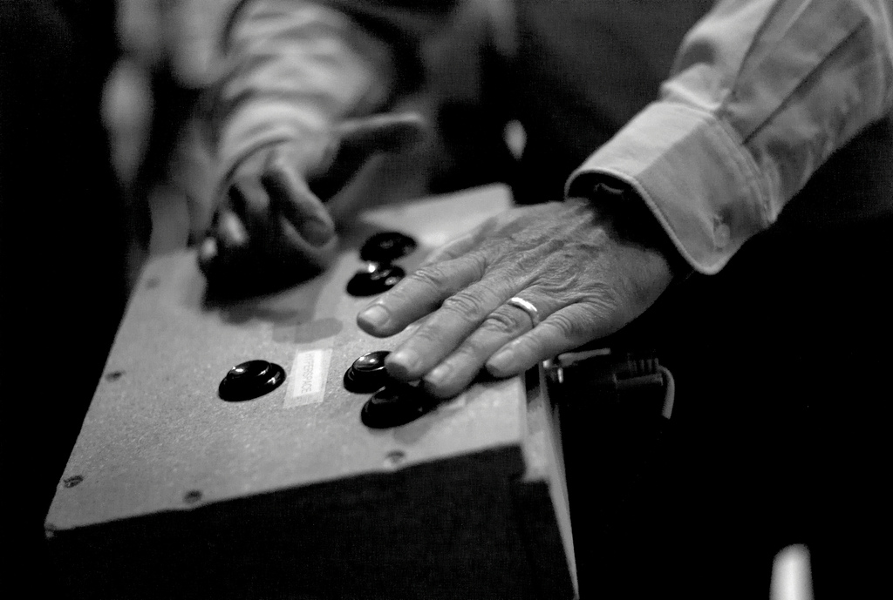

<h1 style="font-size:1000%;">()</h1>

```
Kristoffer Grönlund
kgronlund@suse.com
```

---

# 1955 - 58

---


---

> Our ultimate objective is to make programs that learn from their
> experience as effectively as humans do.

<small>&mdash; John McCarthy</small>

---

## HUMAN-LEVEL AI IS HARDER THAN IT SEEMED IN 1955

<small>&mdash; John McCarthy, 2006</small>

---

- 1956 - IPL 2
- 1957 - FORTRAN <!-- .element: class="fragment" -->
- 1958 - LISP <!-- .element: class="fragment" -->

---

# 1959

---

<!-- .slide: data-background-image="img/ibm-704.jpg" data-background-size="contain" -->

---

<iframe width="720" height="405"
src="https://www.youtube.com/embed/uFQ3sajIdaM" frameborder="0"
allow="accelerometer; autoplay; encrypted-media; gyroscope;
picture-in-picture" allowfullscreen></iframe>

https://youtu.be/uFQ3sajIdaM

---

> Representing sentences by list structure seemed appropriate - <b>it
> still is</b> - and a list processing language also seemed appropriate
> for programming the operations involved in deduction - <b>and still
> is</b>.

<small>&mdash; John McCarthy</small>

---

<!-- .slide: data-background-image="img/doing-it-wrong.jpg" data-background-color="#000000" data-background-size="contain" -->

Note:

Meme found at
https://xach.livejournal.com/170311.html

---

> Another way to show that Lisp was neater than Turing machines was to
> write a universal Lisp function and show that it is briefer and more
> comprehensible than the description of a universal Turing
> machine.

<small>&mdash; John McCarthy</small>

---

> This was the Lisp function eval..., which computes the
> value of a Lisp expression.... Writing eval required inventing a
> notation representing Lisp functions as Lisp data, and such a
> notation was devised for the purposes of the paper with no thought
> that it would be used to express Lisp programs in practice.

<small>&mdash; John McCarthy</small>

---


<small>Photo by <a href="https://creativecommons.org/licenses/by/2.0/">Joi Ito</a></small>

Note:
Photo by Joi Ito
https://creativecommons.org/licenses/by/2.0/

---



<small>Photo by <a href="https://creativecommons.org/licenses/by/2.0/">Joi Ito</a></small>

Note:
Photo by Joi Ito
https://creativecommons.org/licenses/by/2.0/

---

> Steve Russell said, look, why don't I program this eval..., and I
> said to him, ho, ho, you're confusing theory with practice, this
> eval is intended for reading, not for computing.
>
> But he went ahead and did it.

<small>&mdash; John McCarthy</small>

---

> That is, he compiled the eval in my paper into [IBM] 704
> machine code, fixing bugs, and then advertised this as a Lisp
> interpreter, which it certainly was. So at that point Lisp had
> essentially the form that it has today....

<small>&mdash; John McCarthy</small>

---

> Yes, that was the big revelation to me when I was in graduate
> school—when I finally understood that the half page of code on the
> bottom of page 13 of the Lisp 1.5 manual was Lisp in itself. These
> were “Maxwell’s Equations of Software!” This is the whole world of
> programming in a few lines that I can put my hand over.

<small>&mdash; Alan Kay</small>

---

<!-- .slide: data-background-image="img/evalquote.png" data-background-color="#ffffff" data-background-size="contain" -->

---

# s-expressions

---

```
To prevent reading from continuing indefinitely, each packet should
end with STOP followed by a large number of right parentheses. An
unpaired right parenthesis will cause a read error and terminate
reading.

STOP )))))))))))))))))
```

---

```
foo

(a b c d)

()
```

---

```
((a b c) (d e f))
```

---

```
(f x)
```

---

```
(lambda (x) (* x 2))
```

---

```
((lambda (x) (* x 2)) 4)
```

---

```
#t

#f

(atom? x) => #t
```

---

```
(quote a) => a

(quote (a b c)) => (a b c)

'(a b c) => (a b c)
```

---

```
(cons x '(y)) => (x y)

(car (cons x y)) => x

(cdr (cons x y)) => y
```

---

```
(cond 
    ((atom? (quote (a b c))) 10) 
    (#t 20))

=> 20
```

---

```
(equal a b)
```

---

```
(lambda (x) (* x x))
```

---

```
(label square (lambda (x) (* x x )))
```

---

```
(label fac (lambda (n)
  (cond ((equal n 0) 1)
        (#t (* n (fac (- n 1)))))))
```

---

### Lisp Today

- Scheme <!-- .element: class="fragment" -->
- Common Lisp <!-- .element: class="fragment" -->
- Emacs Lisp <!-- .element: class="fragment" -->
- Clojure <!-- .element: class="fragment" -->
- Clojurescript <!-- .element: class="fragment" -->

---

- One
- Two <!-- .element: class="fragment" -->
- Three <!-- .element: class="fragment" -->

---


> When I wrote the following pages, or rather the bulk of them, I
> lived alone, in the woods, a mile from any neighbor, in a house
> which I had built myself, on the shore of Walden Pond, in Concord,
> Massachusetts, and earned my living by the labor of my hands only. I
> lived there two years and two months. At present I am a sojourner in
> civilized life again.

---

> Yes, that was the big revelation to me when I was in graduate
> school—when I finally understood that the half page of code on the
> bottom of page 13 of the Lisp 1.5 manual was Lisp in itself. These
> were “Maxwell’s Equations of Software!” This is the whole world of
> programming in a few lines that I can put my hand over.

---

<!-- .slide: data-background-image="img/lisp15.png" -->

---

<!-- .slide: data-background-image="img/evalquote.png" data-background-size="contain" -->

---

#### Recursive Functions of Symbolic Expressions 
#### and Their Computation by Machine, Part I

---

> [..] whereby a machine could be instructed to handle declarative as
> well as imperative sentences and could exhibit “common sense” in
> carrying out its instructions.

---

This is not the greatest lisp in the world.

This is just a tribute.

---

github.com/krig/LISP

---

# ?

---

## special forms

---

```
(quote X) ; -> X

(cons X Y) ; -> (X Y)

(cond (<case1> <then1>) (<case2> <then2>) ...)

(begin EXPR...)

(or EXPR...)

(define NAME EXPR)

(lambda (ARG...) BODY...)
```

---

## `lisp15.scm`

---

```
(define cadr (lambda (c) (car (cdr c))))
(define cdar (lambda (c) (cdr (car c))))
(define caar (lambda (c) (car (car c))))
(define cddr (lambda (c) (cdr (cdr c))))
(define caadr (lambda (c) (car (car (cdr c)))))
(define cadar (lambda (c) (car (cdr (car c)))))
(define caaar (lambda (c) (car (car (car c)))))
(define caddr (lambda (c) (car (cdr (cdr c)))))
(define cdadr (lambda (c) (cdr (car (cdr c)))))
(define cddar (lambda (c) (cdr (cdr (car c)))))
(define cdaar (lambda (c) (cdr (car (car c)))))
(define cdddr (lambda (c) (cdr (cdr (cdr c)))))
(define not (lambda (x) (cond ((null? x) #t) (#t #f))))
(define atom? (lambda (x) (cond ((null? x) #f) ((pair? x) #f) (#t #t))))
(define else #t)

```

---

```
; build assoclist from lists of keys and values
; x = keys
; y = values
; a = assoclist
(define pairlis (lambda (x y a)
                  (cond ((null? x) a)
                        (else (cons (cons (car x) (car y))
                                    (pairlis (cdr x) (cdr y) a))))))
```

---

```
; find value matching key in assoclist
; x = key
; a = assoclist
(define assoc (lambda (x a)
                (cond ((equal? (caar a) x) (car a))
                      (else (assoc x (cdr a))))))
```
