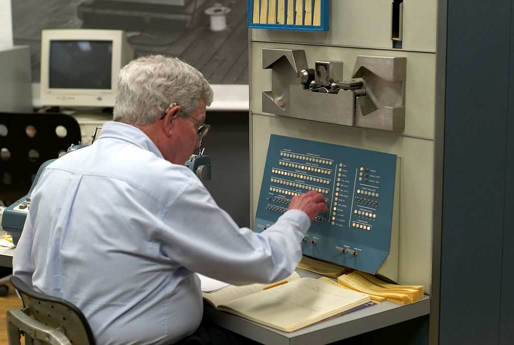
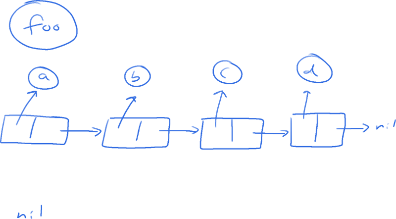
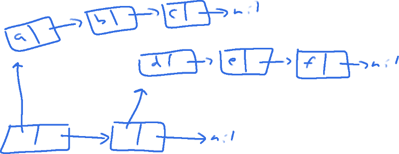

<!-- .slide: data-background-image="img/front.png" data-background-color="#387a3b" -->

---

Recursive Functions of Symbolic Expressions and Their Computation by
Machine, Part I

<small>John McCarthy, Massachusetts Institute of Technology,
Cambridge, Mass.</small>


<small>April 1960</small>

Note:

Papers we love. This talk is going to be a historical deep dive,
followed by way too many slides covered in source code. If we get that
far. Hopefully it will be entertaining at least.

---

# 1955 - 58

Note:

MIT AI lab started ~1955 by Marvin Minsky and John McCarthy.

---


Note:

Source: Courtesy of Stanford University

John McCarthy used an improved version of the Kotok program to play
correspondence chess against a Soviet program developed at the Moscow
Institute for Theoretical and Experimental Physics (ITEP) by George
Adelson-Velsky and others. In 1967, a four-game match played over nine
months was won 3-1 by the Soviet program.

---

> Our ultimate objective is to make programs that learn from their
> experience as effectively as humans do.

<small>&mdash; John McCarthy</small>

---

## HUMAN-LEVEL AI IS HARDER THAN IT SEEMED IN 1955

<small>&mdash; John McCarthy, 2006</small>

---

- 1956 - IPL 2
- 1957 - FORTRAN <!-- .element: class="fragment" -->
- 1958 - LISP <!-- .element: class="fragment" -->

Note:

IPL: List processing language
Fortran: First higher-level language

---

# 1959

---


Note:

Source: https://commons.wikimedia.org/wiki/File:IBM_Electronic_Data_Processing_Machine_-_GPN-2000-001881.jpg

--


Jean Jennings and Fran Bilas, ENIAC, 1948

Note:

1948: Jean Jeannings Bartik, started as a human computer during the
war and led the team of six women that programmed ENIAC. Also in the
photo: Fran Bilas.

"Because they were women, it was assumed that the work they did must
not have been very difficult."

Jean Bartik's autobiography:
https://www.amazon.com/Pioneer-Programmer-Jennings-Computer-Changed/dp/1612480861

Interview:
https://www.youtube.com/watch?v=aPweFhhXFvY

--


Elsa-Karin Boestad-Nilsson

Note:

1950: Elsa-Karin Boestad-Nilsson, programmer on the first computer in
Sweden, called BARK.

Source: https://twitter.com/emnland/status/984120618441469952

--


Note:

Vera Watson was the wife of John McCarthy and was also a notable
programmer. She was originally of chinese russian descent and was
hired by IBM to work on machine language translation but proved to be
a very skilled programmer. She was later involved in developing the
IBM System R, the first SQL database. Outside programming she was also
an accomplished mountain climber. In 1974 she became the first woman
to ascend Aconcagua, the highest mountain in the southerna and western
hemispheres. Sadly, she perished while trying for the peak of
Annapurna in 1978, as part of the American Women's Himalayan
Expedition, of which two different members of the team had reached the
peak two days earlier.

Source:
http://aac-publications.s3.amazonaws.com/documents/aaj/1979/PDF/AAJ_1979_22_1_345.pdf

--

<!-- .slide: data-background-image="img/annapurna.jpg" data-background-color="#000000" data-background-size="contain" -->

Note:

Source:
https://commons.wikimedia.org/wiki/File:Gaint_annapurna_I.jpg
By Mohan K. Duwal, (CC BY-SA 3.0)
https://creativecommons.org/licenses/by-sa/3.0/deed.en

--


Dr. Phyllis Fox

Note:

1958: Dr. Phyllis Fox started a human computer on the Univac together
with Jean Jennings Bartik from the ENIAC. She then wrote the DYNAMO
language, which was a very early simulation language. Wrote the first
manual for LISP and is credited as a collaborator on the first LISP
interpreter. As far as I can tell, apart from McCarthy everyone else
on the team were grad students, so she would have been the only one
with experience implementing a programming language.

Dynamo was used for the "Limits to Growth" simulation in 1972 which
became very famous. 

"Two of the scenarios saw "overshoot and collapse" of the global
system by the mid- to latter-part of the 21st century, while a third
scenario resulted in a "stabilized world"."

After her time at MIT she moved to Bell Labs (birthplace of Unix),
where she created a maths library called PORT. Also wrote a library
called HEMP (High Efficiency Matrix Package).

---

<iframe width="720" height="405"
src="https://www.youtube.com/embed/uFQ3sajIdaM" frameborder="0"
allow="accelerometer; autoplay; encrypted-media; gyroscope;
picture-in-picture" allowfullscreen></iframe>

https://youtu.be/uFQ3sajIdaM

---

> Representing sentences by list structure seemed appropriate - <b>it
> still is</b> - and a list processing language also seemed appropriate
> for programming the operations involved in deduction - <b>and still
> is</b>.

<small>&mdash; John McCarthy</small>

---

<!-- .slide: data-background-image="img/doing-it-wrong.jpg" data-background-color="#000000" data-background-size="contain" -->

Note:

Meme found at
https://xach.livejournal.com/170311.html

---

> Another way to show that Lisp was neater than Turing machines was to
> write a universal Lisp function and show that it is briefer and more
> comprehensible than the description of a universal Turing
> machine.

<small>&mdash; John McCarthy</small>

---

> This was the Lisp function eval..., which computes the
> value of a Lisp expression.... Writing eval required inventing a
> notation representing Lisp functions as Lisp data, and such a
> notation was devised for the purposes of the paper with no thought
> that it would be used to express Lisp programs in practice.

<small>&mdash; John McCarthy</small>

---



<small>Photo by <a href="https://creativecommons.org/licenses/by/2.0/">Joi Ito</a></small>

Note:
Photo by Joi Ito
https://creativecommons.org/licenses/by/2.0/

---

> Steve Russell said, look, why don't I program this eval..., and I
> said to him, ho, ho, you're confusing theory with practice, this
> eval is intended for reading, not for computing.
>
> But he went ahead and did it.

<small>&mdash; John McCarthy</small>

---

## (s-expressions)

--

> To prevent reading from continuing indefinitely, each packet should
> end with STOP followed by a large number of right parentheses. An
> unpaired right parenthesis will cause a read error and terminate
> reading.

<small>&mdash; LISP 1.5 Programmers Manual</small>

--

```
foo

(a b c d)

()
```

--

<!-- .slide: data-background-color="#ffffff" -->



--

```
((a b c) (d e f))
```

--

<!-- .slide: data-background-color="#ffffff" -->



--

```
(f x)
```

--

```
#t

#f

(atom? x) => #t
```

--

```
(quote a) => a

(quote (a b c)) => (a b c)

'(a b c) => (a b c)
```

--

```
(cons x '(y)) => (x y)

(car (cons x y)) => x

(cdr (cons x y)) => y
```

--

```
(lambda (x) (* x 2))
```

--

```
((lambda (x) (* x 2)) 4)
```

--

```
(cond 
    ((atom? (quote (a b c))) 10) 
    (#t 20))

=> 20
```

--

```
(equal a b)
```

--

```
(label square (lambda (x) (* x x )))
```

--

```
(label fac (lambda (n)
  (cond ((equal n 0) 1)
        (#t (* n (fac (- n 1)))))))
```

---

<!-- .slide: data-background-image="img/evalquote.png" data-background-color="#ffffff" data-background-size="contain" -->

---

> Yes, that was the big revelation to me when I was in graduate
> school—when I finally understood that the half page of code on the
> bottom of page 13 of the Lisp 1.5 manual was Lisp in itself. These
> were “Maxwell’s Equations of Software!” This is the whole world of
> programming in a few lines that I can put my hand over.

<small>&mdash; Alan Kay</small>

---

### Lisp Today

Note:

Scheme, Common Lisp, Emacs Lisp, Clojure, Clojurescript
GC/VM: Java, Javascript, Perl, Ruby, Python

---

### Lisp & Linux

Note:

Why open source is important: Unbroken connection to the past.
Wisdom and craft. Culture.
Lisp: First time source code mattered beyond the machine - easily
portable, flexible - so small that it fits on a piece of paper.

---

### Reinventing the Wheel

Note:

Reinventing the wheel is good - refining tools and processes - make
the wheel as small as possible. Iterate and hone tools and
skills. Parallel - nomadic life style - survival in harsh climates.

--

```
mmmfmmmf
494 Adam Kristoffersson, född i Ångermannabyn, Åsele,
    död 1721-12-18 i Noret, Åsele. Skattlapp klockare nybyggare
    i Noret, Åsele. Tog upp Noret 1690.
    
    Tillhörde en av lappojkarna som med tvång togs till 
    skolan i Lycksele trots föräldrarnas protester.
```

---

#### This is not the greatest lisp in the world.

#### This is just a tribute.

---

<a href="https://github.com/krig/LISP">github.com/krig/lisp</a>

---

* ~560 lines of C
* Copying garbage collector
* Implementation of LISP 1.5 eval

---

### 1. Allocation

---

```
typedef enum { T_CONS, T_ATOM, T_CFUNC, T_LAMBDA } object_tag;

struct object_t;
typedef struct object_t *(*cfunc)(struct object_t *);

typedef struct object_t {
	struct object_t *car, *cdr;
	object_tag tag;
} object;
```

---

#### A Nonrecursive List Compacting Algorithm

<small>C.J. Cheney, 1970</small>

---

```
object *gc_alloc(object_tag tag, object *car, object *cdr) {
	if (allocptr + 1 > fromspace + HEAPSIZE)
		gc_collect();
	if (allocptr + 1 > fromspace + HEAPSIZE)
		abort();
	allocptr->tag = tag;
	allocptr->car = car;
	allocptr->cdr = cdr;
	return allocptr++;
}
```

---

```
void gc_collect(void) {
	object *tmp = fromspace;
	fromspace = tospace;
	tospace = tmp;
	allocptr = scanptr = fromspace;

	for (size_t i = 0; i < numroots; ++i)
		gc_copy(roots[i]);

	for (; scanptr < allocptr; ++scanptr)
		if (scanptr->tag == T_CONS) {
			gc_copy(&(scanptr->car));
			gc_copy(&(scanptr->cdr));
		}
}
```

---

```
void gc_copy(object **root) {
	if (*root == NULL)
		return;
	if ((*root)->car == &fwdmarker) {
		*root = (*root)->cdr;
	} else if (*root < fromspace || *root >= (fromspace + HEAPSIZE)) {
		object *p = allocptr++;
		memcpy(p, *root, sizeof(object));
		(*root)->car = &fwdmarker;
		(*root)->cdr = p;
		*root = p;
	}
}
```

---

```
void gc_protect(object **r, ...) {
	rootstack[roottop++] = numroots;
	va_list args;
	va_start(args, r);
	for (object ** p = r; p != NULL; p = va_arg(args, object **)) {
		assert(numroots < MAXROOTS);
		roots[numroots++] = p;
	}
	va_end(args);
}

void gc_pop(void) {
	numroots = rootstack[--roottop];
}
```

---

### 2. Read

---

```
object *lisp_read(FILE *in) {
	const char *tok = read_token(in);
	if (tok == NULL)
		return NULL;
	if (tok[0] != ')')
		return lisp_read_obj(tok, in);
	fprintf(stderr, "Error: Unexpected )\n");
	return NULL;
}
```

---

```
const char *read_token(FILE *in) {
	int n = 0;
	while (isspace(token_peek))
		token_peek = fgetc(in);
	if (token_peek == '(' || token_peek == ')') {
		token_text[n++] = token_peek;
		token_peek = fgetc(in);
	} else while (ATOMCHAR(token_peek)) {
		token_text[n++] = token_peek;
		token_peek = fgetc(in);
	}
	if (token_peek == EOF) exit(0);
	token_text[n] = '\0';
	return intern_string(token_text);
}
```

---

```
object *lisp_read_obj(const char *tok, FILE *in) {
	return (tok[0] != '(') ? new_atom(tok) :
		lisp_read_list(read_token(in), in);
}
```

---

```
object *lisp_read_list(const char *tok, FILE *in) {
	if (tok[0] == ')')
		return NULL;
	object *obj = NULL, *tmp = NULL, *obj2 = NULL;
	obj = lisp_read_obj(tok, in);
	tok = read_token(in);
	tmp = lisp_read_list(tok, in);
	obj2 = new_cons(obj, tmp);
	return obj2;
}
```

---

### 3. Print

---

```
void lisp_print(object *obj) {
	if (obj == NULL) {
		printf("()");
	} else if (obj->tag == T_ATOM) {
		printf("%s", TEXT(obj));
	} else if (obj->tag == T_CFUNC) {
		printf("<C@%p>", (void *)obj);
	} else if (obj->tag == T_LAMBDA) {
		printf("<lambda ");
		lisp_print(obj->car);
		printf(">");
	} else if (obj->tag == T_CONS) {
      /* next slide ... */
	}
}
```

---

```
		printf("(");
		for (;;) {
			lisp_print(obj->car);
			if (obj->cdr == NULL)
				break;
			printf(" ");
			obj = obj->cdr;
		}
		printf(")");
```

---

### 4. Eval

---

```
object *lisp_eval(object *expr, object *env) {
restart:
	if (expr == NULL)
		return expr;
	if (expr->tag == T_ATOM && match_number(TEXT(expr)))
		return expr;
	if (expr->tag == T_ATOM)
		return env_lookup(expr, env);
	if (expr->tag != T_CONS)
		return expr;
    
    ...
```

---

```
	if (expr == NULL)
		return expr;
	if (expr->tag == T_ATOM && match_number(TEXT(expr)))
		return expr;
	if (expr->tag == T_ATOM)
		return env_lookup(expr, env);
	if (expr->tag != T_CONS)
		return expr;
```

---

```
	object *head = expr->car;

    if (TEXT(head) == TQUOTE) {
		return expr->cdr->car;
	} else if (TEXT(head) == TCOND) {
```

---

```
	} else if (TEXT(head) == TCOND) {
		object *item = NULL, *cond = NULL;
		for (item = expr->cdr; item != NULL; item = item->cdr) {
			cond = item->car;
			if (lisp_eval(cond->car, env) != NULL) {
				expr = cond->cdr->car;
				goto restart;
			}
		}
		abort();
	} else if (TEXT(head) == TDEFINE) {
```

---

```
	} else if (TEXT(head) == TDEFINE) {
		object *name = NULL;
		object *value = NULL;
		name = expr->cdr->car;
		value = lisp_eval(expr->cdr->cdr->car, env);
		env_set(env, name, value);
		return value;
	} else if (TEXT(head) == TLAMBDA) {
```

---

```
	} else if (TEXT(head) == TLAMBDA) {
		expr->cdr->tag = T_LAMBDA;
		return expr->cdr;
	}
```

---

```
	object *fn = NULL, *args = NULL, *params = NULL, *param = NULL;
	fn = lisp_eval(head, env);
	if (fn->tag == T_CFUNC) {
```

---

```
	if (fn->tag == T_CFUNC) {
		for (params = expr->cdr; params != NULL; params = params->cdr) {
			param = lisp_eval(params->car, env);
			args = new_cons(param, args);
		}
		object *ret = ((cfunc)fn->car)(list_reverse(args));
		return ret;
	} else if (fn->tag == T_LAMBDA) {
```

---

```
	} else if (fn->tag == T_LAMBDA) {
		object *callenv = new_env(env);
		args = fn->car;
		object *item = NULL;
		for (params = expr->cdr; params != NULL; params = params->cdr, args = args->cdr) {
			param = lisp_eval(params->car, env);
			env_set(callenv, args->car, param);
		}
```

---

```
        
		for (item = fn->cdr; item != NULL; item = item->cdr) {
			if (item->cdr == NULL) {
				expr = item->car;
				env = callenv;
				goto restart;
			}
			lisp_eval(item->car, callenv);
		}
	}
```

---

```
	for (;;) {
		obj = lisp_read(in);
		obj = lisp_eval(obj, env);
		lisp_print(obj);
		printf("\n");
	}
```

---

```
STOP ))))))))))))))
```

