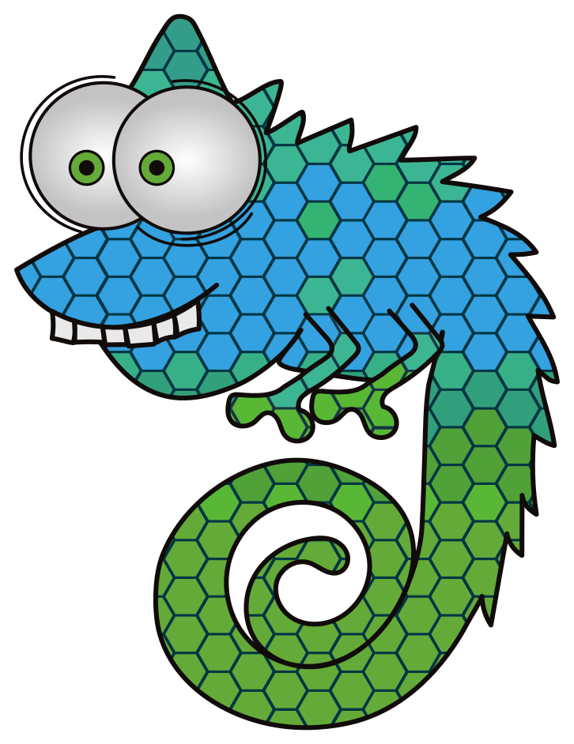

# LET'S LISP LIKE IT'S 1959

## VERSION II

<small>
<br><br><br>
<code>Kristoffer Grönlund, SUSE</code><br>
<code>kgronlund@suse.com</code>
</small>

---


Note:

About me: Work from home in Sweden, four cats.

---



Note:

I work for SUSE, thanks to SUSE for making it possible for me to be
here. All views expressed are mine and not my employers.

---

Recursive Functions of Symbolic Expressions and Their Computation by
Machine, Part I

<small>John McCarthy, Massachusetts Institute of Technology,
Cambridge, Mass.</small>


<small>April 1960</small>

Note:

Papers we love. This talk is going to be a historical deep dive,
with a lot of side tracks and diversions. It's not going to be a Lisp
tutorial, although I hope I'll have time to show you a bit about how
to write your own Lisp. Hopefully it will be entertaining.
Started with me reading this paper and deciding to write my own Lisp
interpreter. Have written at least four different interpreters and
various bits of compilers and virtual machines now.

---

# 1955 - 58

Note:

MIT AI lab started ~1955 by Marvin Minsky and John McCarthy.
McCarthy coined the term "Artificial Intelligence".
Background in logic and math.

---


Note:

Computer chess game against the Soviet union, in 1967. The Soviets won
3-1.
McCarthys parents were communists, he spoke russian and got his
passion for math from russian language books his parents had.

Source: Courtesy of Stanford University

---

> Our ultimate objective is to make programs that learn from their
> experience as effectively as humans do.

<small>&mdash; John McCarthy</small>

Note:

Big aspirations: Making computers that think and learn. Felt that
human-level AI was very close. Big question was how to represent
knowledge in machines.

---

## HUMAN-LEVEL AI IS HARDER THAN IT SEEMED IN 1955

<small>&mdash; John McCarthy, 2006</small>

Note:

AI Winter, turns out AI is a lot harder than expected.
Actually AI still seems to be surprisingly hard. Self-driving cars
is still not quite there. Second AI winter coming?

--

<!-- .slide: data-background-color="#ffffff" -->


Note:

Volvo and Skanska:
Carbon emissions reduced by 98%, autonomous quarry.

--

<!-- .slide: data-background-color="#ffffff" -->


Note:

Waymo, Google self driving car project, widely seen as being the most
promising self-driving car project at the moment...

---

- 1956 - IPL 2
- 1957 - FORTRAN <!-- .element: class="fragment" -->
- 1958 - LISP <!-- .element: class="fragment" -->

Note:

IPL: List processing language
Fortran: First higher-level language

---

# 1959

---


Note:

The AI lab had access to a IBM 704 computer so that is the computer
they used. Consisted of basically three fridges: A punch card reader,
a processor and a printer.

"It may be hard to visualize a 704 or to comprehend the place it held
in the public imagination as the type specimen of what a computer was:
a collection of mysterious hulking gray cabinets approachable only
through the intercession of The Operator. In the specially built
computer room, The Operator set switches, pushed buttons, and examined
panels of flashing lights, while [..] Assistants attended various
whirring, clanking, and chattering devices, rushing to and fro with
stacks of cryptically-printed paper, decks of weirdly-punched cards,
and reels of [..] brown ribbon, all to the background hum of The
Machine. Add a little incense and a few candles, and you could be
forgiven for thinking these were the rites of some oracular shrine."

Image source:
https://commons.wikimedia.org/wiki/File:IBM_Electronic_Data_Processing_Machine_-_GPN-2000-001881.jpg 
Quote source:
https://www.masswerk.at/spacewar/SpacewarOrigin.html

--

<iframe width="720" height="405"
src="https://www.youtube.com/embed/uFQ3sajIdaM" frameborder="0"
allow="accelerometer; autoplay; encrypted-media; gyroscope;
picture-in-picture" allowfullscreen></iframe>

https://youtu.be/uFQ3sajIdaM

--


Jean Jennings and Fran Bilas, ENIAC, 1948

Note:

1948: Jean Jeannings Bartik, started as a human computer during the
war and led the team of six women that programmed ENIAC. Also in the
photo: Fran Bilas.

"Because they were women, it was assumed that the work they did must
not have been very difficult."

Jean Bartik's autobiography:
https://www.amazon.com/Pioneer-Programmer-Jennings-Computer-Changed/dp/1612480861

Interview:
https://www.youtube.com/watch?v=aPweFhhXFvY

--


Elsa-Karin Boestad-Nilsson

Note:

1950: Elsa-Karin Boestad-Nilsson, programmer on the first computer in
Sweden, called BARK.

Source: https://twitter.com/emnland/status/984120618441469952

--


Note:

Wife of JMC. Notable programmer.
Chinese russian descent, hired by IBM for machine language
translation but proved to be a very skilled programmer.
Worked on IBM System R, the first SQL database.
1974: First woman to ascend Aconcagua, highest mountain in southern
and western hemispheres.
1978: American Women's Himalayan Expedition, Annapurna I, died.
Two other members of the team did reach the peak.

Source:
http://aac-publications.s3.amazonaws.com/documents/aaj/1979/PDF/AAJ_1979_22_1_345.pdf

--

<!-- .slide: data-background-image="img/annapurna.jpg" data-background-color="#000000" data-background-size="contain" -->

Note:

Source:
https://commons.wikimedia.org/wiki/File:Gaint_annapurna_I.jpg
By Mohan K. Duwal, (CC BY-SA 3.0)
https://creativecommons.org/licenses/by-sa/3.0/deed.en

--

<!-- .slide: data-background-image="img/annapurna-book.jpg" data-background-color="#000000" data-background-size="contain" -->

---


Dr. Phyllis Fox

Note:

1958: Dr. Phyllis Fox started a human computer on the Univac together
with Jean Jennings Bartik from the ENIAC, then worked on a differential 
analyzer (pre-computer). In 1949 she worked with the Whirlwind team, 
writing software for the machine being built. She later worked the DYNAMO
language, which was a very early simulation language. Wrote the first
manual for LISP and is credited as a collaborator on the first LISP
interpreter. As far as I can tell, apart from McCarthy everyone else
on the team were grad students, so she would have been the only one
with experience implementing a programming language.

After her time at MIT she moved to Bell Labs (birthplace of Unix),
where she created a maths library called PORT.

Copyright © by the Computer History Museum. Use of this the material for
research purposes is allowed. Any such use should cite the SIAM History
of Numerical Analysis and Scientific Computing Project
(http://history.siam.org).

--


Note:

Thanks to the wonders of youtube comments, more details on Prof. Fox.

"I would ask questions from Minsky or McCarthy, and I got it done. 
I think it was helpful for people to have it. I guess, essentially 
I’m a documenter. If you’re looking for it, that’s what I am." 

--


Note:

The door opened, and some high powered person came in with three men. They were probably all in suits, and they looked at the analyzer. I was used to visitors, so I showed them everything. Towards the end [...], the big boss said "Now, these three gentlemen are going to work here and run this machine, and you will work for them."

--


Note:

Every now and then, I'd see that I needed a certain instruction that they hadn't yet included in Whirlwind's commands. And I would tell the engineers about it. I had the timing diagrams showing the paths and timing of the electric pulses, so I knew how the machine worked and what was feasible. For example I found that it would be useful to have an instruction that would add one to the current address, AO I called it. It was essentially, I guess, a loop mechanism that I was inventing then. So they changed some of the instruction set on Whirlwind and I think they found it useful to have someone actually writing a program for it.

---

> Representing sentences by list structure seemed appropriate - <b>it
> still is</b> - and a list processing language also seemed appropriate
> for programming the operations involved in deduction - <b>and still
> is</b>.

<small>&mdash; John McCarthy</small>

Note:

Love this quote, expresses such confidence

---

<!-- .slide: data-background-image="img/doing-it-wrong.jpg" data-background-color="#000000" data-background-size="contain" -->

Note:

Meme found at
https://xach.livejournal.com/170311.html

---

> Another way to show that Lisp was neater than Turing machines was to
> write a universal Lisp function and show that it is briefer and more
> comprehensible than the description of a universal Turing
> machine.

<small>&mdash; John McCarthy</small>

---

> This was the Lisp function eval..., which computes the
> value of a Lisp expression.... Writing eval required inventing a
> notation representing Lisp functions as Lisp data, and such a
> notation was devised for the purposes of the paper with no thought
> that it would be used to express Lisp programs in practice.

<small>&mdash; John McCarthy</small>

---


Note:

Source: https://www.masswerk.at/spacewar/SpacewarOrigin.html
Photo by Joi Ito
https://creativecommons.org/licenses/by/2.0/

---


---


> Steve Russell said, look, why don't I program this eval..., and I
> said to him, ho, ho, you're confusing theory with practice, this
> eval is intended for reading, not for computing.
>
> But he went ahead and did it.

<small>&mdash; John McCarthy</small>

---

## (s expressions)

Note:

OK so at this point I should introduce the actual syntax of lisp,
called S expressions.

---


Note:

S expressions were based on something called the lambda calculus
invented in the 1930s by Alonzo Church, and it's a mathematical
notation for expressing computation based on function
application. Basically, the idea is that all computations can be
expressed as function application.

---

> To prevent reading from continuing indefinitely, each packet should
> end with STOP followed by a large number of right parentheses. An
> unpaired right parenthesis will cause a read error and terminate
> reading.

<small>&mdash; LISP 1.5 Programmers Manual</small>

Note:

The most immediate feature of S expressions is the abundance of
parentheses. There is no getting away from that: There are a lot of
parentheses and keeping track of them is a pain. So it is absolutely
essential to have an editor which helps you manage them by
highlighting pairs and so on.

Of course back then they didn't have editors, they had punch cards. So
the advice given in the LISP manual was to add an extra punch card at
the end of each batch that has a bunch of closing parens, just to make
sure that things don't keep going forever.

---


---

<!-- .slide: data-background-image="img/notes2.png" data-background-color="#ffffff" data-background-size="contain" -->

---

<!-- .slide: data-background-image="img/notes3.png" data-background-color="#ffffff" data-background-size="contain" -->


---

<!-- .slide: data-background-image="img/notes1.png" data-background-color="#ffffff" data-background-size="contain" -->


Note:

Cons = short for construct
CAR = Contents of the Address part of Register
CDR = Contents of the Decrement part of Register

---

<!-- .slide: data-background-image="img/funcalls.png" data-background-color="#ffffff" data-background-size="contain" -->

Note:

Lambda represents a function, from the lambda calculus

---

<!-- .slide: data-background-image="img/recursive.png" data-background-color="#ffffff" data-background-size="contain" -->

Note:

With recursive functions, you can express anything. Naming makes it easier to make recursive functions, but you don't have to - Y combinator is the way to construct recursive functions with pure lambda calculus.

---

<!-- .slide: data-background-image="img/evalquote.png" data-background-color="#ffffff" data-background-size="contain" -->

---

> Yes, that was the big revelation to me when I was in graduate
> school—when I finally understood that the half page of code on the
> bottom of page 13 of the Lisp 1.5 manual was Lisp in itself. These
> were “Maxwell’s Equations of Software!” This is the whole world of
> programming in a few lines that I can put my hand over.

<small>&mdash; Alan Kay</small>

---

## CODE = DATA

Note:

One thing that Lisp revealed is that code and data at its root are the
same thing. There is no sharp boundary between the two, even though we
like to pretend there is.

Lisp is really good for things that are both code and data. XML for
example is OK for data, but terrible for code - see rule expressions
or if/else statements encoded in XML - I really wish there was more
lisp / s expression usage out there.

---

### Why Lisp?

Note:

Why open source is important: Unbroken connection to the past.
Wisdom and craft. Culture.
Lisp: First time source code mattered beyond the machine - easily
portable, flexible - so small that it fits on a piece of paper.
Garbage collection, virtual machines, programs that write programs,
portability - all started with lisp.
Earlier talk mentioned value of learning assembler to really
understand how things work - learning lisp reveals how computing
really works, not physically but as a mathematical process.

--

### Why Free Software??

Note:

Richard Stallman came up with Free Software to defend the old ways
from the new thing: Proprietary software. Free software was not a new
invention. It is the unbroken lineage that goes back to the first Lisp
interpreter and continues in Linux today, of a culture building on
itself. It is proprietary software that breaks that lineage. That, I
think, is one reason why Lisp is relevant to us - it is the legacy
that we carry.

--


Note:

Little is known about the use of these drums - they were all burned,
stolen or hidden in the 17th and 18th centuries when the Swedish
government discovered silver in the mountains of the north and started
an internal colonisation process.

---

### <a href="https://github.com/krig/LISP">github.com/krig/lisp</a>

* &lt; 500 lines of C
* Interpreter
* Copying garbage collector
* LISP 1.5 eval written in lisp

---

<!-- .slide: data-background-image="img/gc2.png" data-background-color="#ffffff" data-background-size="contain" -->

---

### Let's write a garbage collector!

--

A Nonrecursive List Compacting Algorithm

<small>C.J. Cheney, 1970</small>

--

<!-- .slide: data-background-image="img/gc1.png" data-background-color="#ffffff" data-background-size="contain" -->

--

### `collect`

1. Swap `curr` and `next` spaces
1. For each *root*;
   1. **Copy** object pointed to by root to `curr`
2. For each cons cell in `curr`:
   1. **Copy** object pointed to by `car` to `curr`
   2. **Copy** object pointed to by `cdr` to `curr`

--

### `copy`

1. If object is a *forward pointer*;
   1. Update pointer to object to target of *forward pointer*
2. Else;
   2. Copy object to `curr`
   3. Replace object in `next` with *forward pointer*

--

```
typedef enum { T_CONS, T_ATOM, T_CFUNC, T_LAMBDA } object_tag;

struct object_t;
typedef struct object_t *(*cfunc)(struct object_t *);

typedef struct object_t {
	struct object_t *car, *cdr;
	object_tag tag;
} object;
```

--

<pre class="stretch">
<code data-trim class="hljs">
object *gc_alloc(object_tag tag, object *car, object *cdr) {
	if (allocptr + 1 > fromspace + HEAPSIZE)
		gc_collect();
	if (allocptr + 1 > fromspace + HEAPSIZE)
		abort();
	allocptr->tag = tag;
	allocptr->car = car;
	allocptr->cdr = cdr;
	return allocptr++;
}
</code>
</pre>

--

<pre class="stretch">
<code data-trim class="hljs">
void gc_collect(void) {
	object *tmp = fromspace;
	fromspace = tospace;
	tospace = tmp;
	allocptr = scanptr = fromspace;

	for (size_t i = 0; i < numroots; ++i)
		gc_copy(roots[i]);

	for (; scanptr < allocptr; ++scanptr)
		if (scanptr->tag == T_CONS) {
			gc_copy(&(scanptr->car));
			gc_copy(&(scanptr->cdr));
		}
}
</code>
</pre>

--

<pre class="stretch">
<code data-trim class="hljs">
void gc_copy(object **root) {
	if (*root == NULL)
		return;
	if ((*root)->car == &fwdmarker) {
		*root = (*root)->cdr;
	} else {
		object *p = allocptr++;
		memcpy(p, *root, sizeof(object));
		(*root)->car = &fwdmarker;
		(*root)->cdr = p;
		*root = p;
	}
}
</code>
</pre>

--

<pre class="stretch">
<code data-trim class="hljs">
void gc_protect(object **r, ...) {
	rootstack[roottop++] = numroots;
	va_list args;
	va_start(args, r);
	for (object ** p = r; p != NULL; p = va_arg(args, object **)) {
		assert(numroots < MAXROOTS);
		roots[numroots++] = p;
	}
	va_end(args);
}

void gc_pop(void) {
	numroots = rootstack[--roottop];
}
</code>
</pre>

---

### READ

--

### `read_obj`

1. Read a *token* from input.
2. If *token* is a `(`;
   1. Read a list from input.
3. Return an atom.

--

### `read_list`

1. Peek at next *token*.
2. If *token* is a `)`;
  1. Read *token* from input.
  2. Return list.
3. Call `read_obj` and add result to list.
4. Go to 1.

--

<pre class="stretch">
<code data-trim class="hljs">
object *lisp_read(FILE *in) {
	const char *tok = read_token(in);
	if (tok == NULL)
		return NULL;
	if (tok[0] != ')')
		return lisp_read_obj(tok, in);
	fprintf(stderr, "Error: Unexpected )\n");
	return NULL;
}
</code>
</pre>

--

<pre class="stretch">
<code data-trim class="hljs">
const char *read_token(FILE *in) {
	int n = 0;
	while (isspace(token_peek))
		token_peek = fgetc(in);
	if (token_peek == '(' || token_peek == ')') {
		token_text[n++] = token_peek;
		token_peek = fgetc(in);
	} else while (ATOMCHAR(token_peek)) {
		token_text[n++] = token_peek;
		token_peek = fgetc(in);
	}
	if (token_peek == EOF) exit(0);
	token_text[n] = '\0';
	return intern_string(token_text);
}
</code>
</pre>

--

<pre class="stretch">
<code data-trim class="hljs">
object *lisp_read_obj(const char *tok, FILE *in) {
	return (tok[0] != '(') ? new_atom(tok) :
		lisp_read_list(read_token(in), in);
}
</code>
</pre>

--

<pre class="stretch">
<code data-trim class="hljs">
object *lisp_read_list(const char *tok, FILE *in) {
	if (tok[0] == ')')
		return NULL;
	object *obj = NULL, *tmp = NULL, *obj2 = NULL;
	obj = lisp_read_obj(tok, in);
	tok = read_token(in);
	tmp = lisp_read_list(tok, in);
	obj2 = new_cons(obj, tmp);
	return obj2;
}
</code>
</pre>

---

### PRINT

--

<pre class="stretch">
<code data-trim class="hljs">
void lisp_print(object *obj) {
	if (obj == NULL) {
		printf("()");
	} else if (obj->tag == T_ATOM) {
		printf("%s", TEXT(obj));
	} else if (obj->tag == T_CONS) {
		printf("(");
		for (;;) {
			lisp_print(obj->car);
			if (obj->cdr == NULL)
				break;
			printf(" ");
			obj = obj->cdr;
		}
		printf(")");
	}
}
</code>
</pre>

---

### EVAL

--

<pre class="stretch">
<code data-trim class="hljs">
object *lisp_eval(object *expr, object *env) {
restart:
	if (expr == NULL)
		return expr;
	if (expr->tag == T_ATOM && match_number(TEXT(expr)))
		return expr;
	if (expr->tag == T_ATOM)
		return env_lookup(expr, env);
	if (expr->tag != T_CONS)
		return expr;
    
    ...
</code>
</pre>

--

<pre class="stretch">
<code data-trim class="hljs">
	if (expr == NULL)
		return expr;
	if (expr->tag == T_ATOM && match_number(TEXT(expr)))
		return expr;
	if (expr->tag == T_ATOM)
		return env_lookup(expr, env);
	if (expr->tag != T_CONS)
		return expr;
</code>
</pre>

--

<pre class="stretch">
<code data-trim class="hljs">
	object *head = expr->car;

    if (TEXT(head) == TQUOTE) {
		return expr->cdr->car;
	} else if (TEXT(head) == TCOND) {
</code>
</pre>

--

<pre class="stretch">
<code data-trim class="hljs">
	} else if (TEXT(head) == TCOND) {
		object *item = NULL, *cond = NULL;
		for (item = expr->cdr; item != NULL; item = item->cdr) {
			cond = item->car;
			if (lisp_eval(cond->car, env) != NULL) {
				expr = cond->cdr->car;
				goto restart;
			}
		}
		abort();
	} else if (TEXT(head) == TDEFINE) {
</code>
</pre>

--

<pre class="stretch">
<code data-trim class="hljs">
	} else if (TEXT(head) == TDEFINE) {
		object *name = NULL;
		object *value = NULL;
		name = expr->cdr->car;
		value = lisp_eval(expr->cdr->cdr->car, env);
		env_set(env, name, value);
		return value;
	} else if (TEXT(head) == TLAMBDA) {
</code>
</pre>

--

```
	} else if (TEXT(head) == TLAMBDA) {
		expr->cdr->tag = T_LAMBDA;
		return expr->cdr;
	}
```

--

```
	object *fn = NULL, *args = NULL, *params = NULL, *param = NULL;
	fn = lisp_eval(head, env);
	if (fn->tag == T_CFUNC) {
```

--

```
	if (fn->tag == T_CFUNC) {
		for (params = expr->cdr; params != NULL; params = params->cdr) {
			param = lisp_eval(params->car, env);
			args = new_cons(param, args);
		}
		object *ret = ((cfunc)fn->car)(list_reverse(args));
		return ret;
	} else if (fn->tag == T_LAMBDA) {
```

--

```
	} else if (fn->tag == T_LAMBDA) {
		object *callenv = new_env(env);
		args = fn->car;
		object *item = NULL;
		for (params = expr->cdr; params != NULL; params = params->cdr, args = args->cdr) {
			param = lisp_eval(params->car, env);
			env_set(callenv, args->car, param);
		}
```

--

```
        
		for (item = fn->cdr; item != NULL; item = item->cdr) {
			if (item->cdr == NULL) {
				expr = item->car;
				env = callenv;
				goto restart;
			}
			lisp_eval(item->car, callenv);
		}
	}
```

--

```
	for (;;) {
		obj = lisp_read(in);
		obj = lisp_eval(obj, env);
		lisp_print(obj);
		printf("\n");
	}
```

---

```
STOP ))))))))))))))
```

